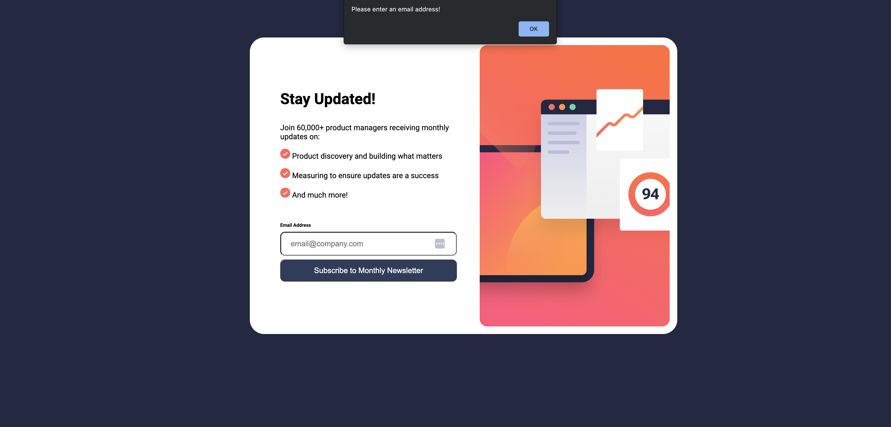
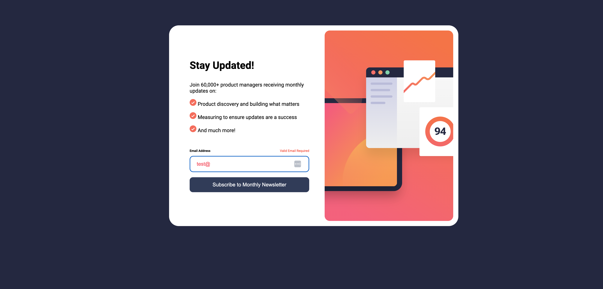
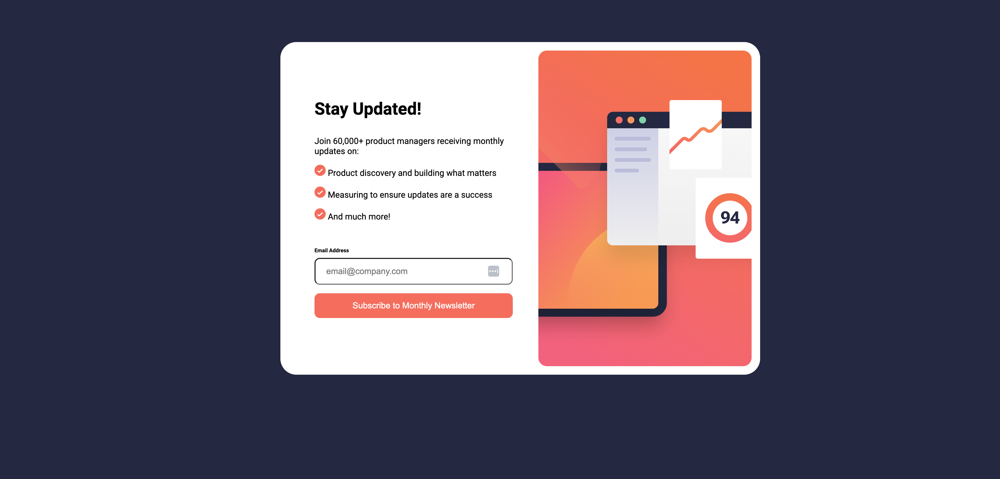
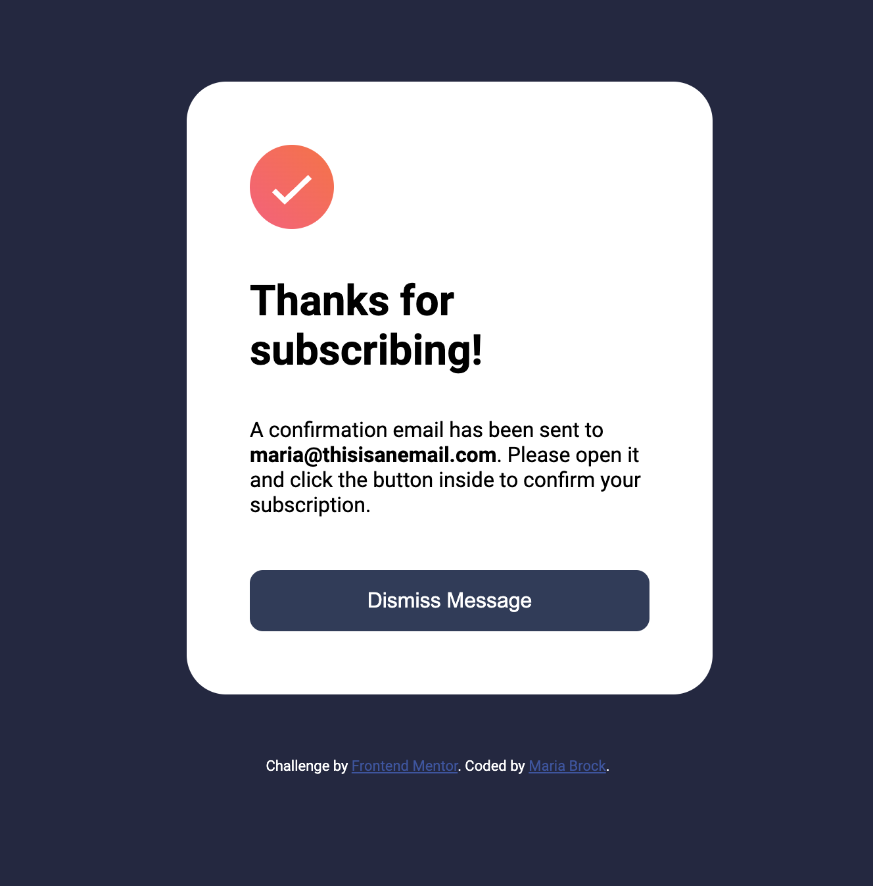
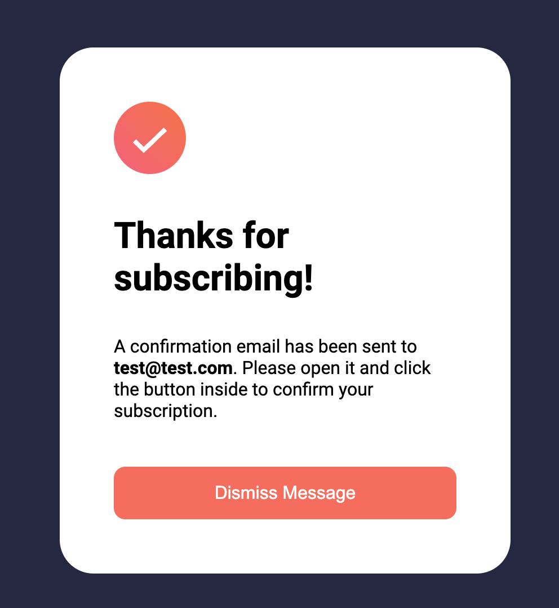
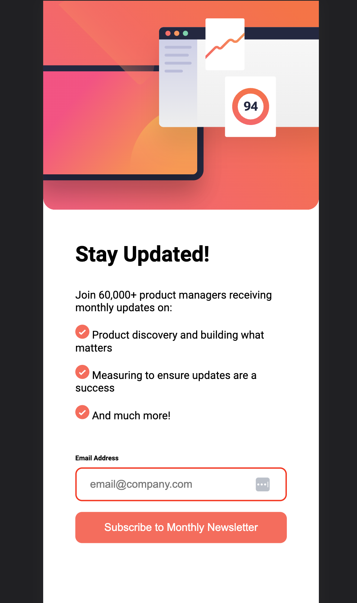
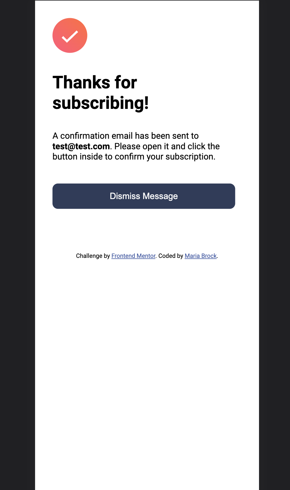

# Frontend Mentor - Newsletter sign-up form with success message solution

This is a solution to the [Newsletter sign-up form with success message challenge on Frontend Mentor](https://www.frontendmentor.io/challenges/newsletter-signup-form-with-success-message-3FC1AZbNrv). Frontend Mentor challenges help you improve your coding skills by building realistic projects. 

## Table of contents

- [Overview](#overview)
  - [The challenge](#the-challenge)
  - [Screenshot](#screenshot)
  - [Links](#links)
- [My process](#my-process)
  - [Built with](#built-with)
  - [What I learned](#what-i-learned)
  - [Useful resources](#useful-resources)
- [Author](#author)

## Overview

### The challenge

Users should be able to:

- Add their email and submit the form
- See a success message with their email after successfully submitting the form
- See form validation messages if:
  - The field is left empty
  - The email address is not formatted correctly
- View the optimal layout for the interface depending on their device's screen size
- See hover and focus states for all interactive elements on the page

### Screenshot










### Links

- Solution URL: [Github](https://github.com/mariabrock/frontendmeentorio-newsletter-sign-up)
- Live Site URL: [Newsletter](https://mariabrock.github.io/frontendmeentorio-newsletter-sign-up/)

## My process

### Built with

- Semantic HTML5 markup
- CSS custom properties
- Flexbox
- CSS Grid
- Mobile-first workflow

### What I learned

```html
  <form  id="form" action="#">
    <div id="input-control">
      <label for="email">Email Address</label>
      <span id="error-msg"></span>
      <input type="email"
         id="email"
         name="email"
         placeholder="email@company.com"
         required>
      <button class="button submit-btn" type="submit">Subscribe to Monthly Newsletter</button>
    </div>
  </form>
```
```css
  :root {
    --dark-slate-grey: hsl(234, 29%, 20%);
    --charcoal-grey: hsl(235, 18%, 26%);
    --grey: hsl(231, 7%, 60%);
    --white: hsl(0, 0%, 100%);
    --tomato: hsl(4, 100%, 67%);
  }
```
```js
  submitBtn.addEventListener('click', () => {
    const emailInput = document.querySelector('#email');
    const userEmail = emailInput.value;
    if(userEmail === '') {
      alert("Please enter an email address!")
      emailInput.style.border = "solid red 2px";
    } else {
      console.log(userEmail);
      successCard.style.visibility = 'visible';
      previewCard.remove();
      document.querySelector(".user-email").innerText = userEmail;
    }
  })
```

### Useful resources

- [Regex Example Video](https://www.youtube.com/watch?v=s2ThIxm7FyA&ab_channel=KevinPowell) - Kevin has a great library of fun/cool/useful CSS tricks.
- [Regex Generator](https://regexr.com/) - Generator website to help with getting your Regex correct.

## Author

- Github - [@mariabrock](https://github.com/mariabrock)
- Frontend Mentor - [@mariabrock](https://www.frontendmentor.io/profile/mariabrock)
- LinkedIn - [@mariabrock](https://www.linkedin.com/in/maria-brock/)

